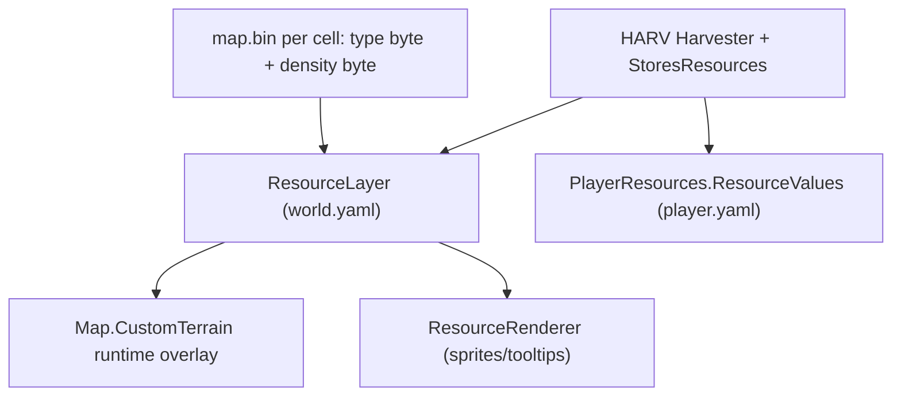

# Add Void Crystals Resource (Local Dev Fork)

## How resources work in OpenRA



- **Saved in maps:** only a **type index** (byte) and **density** (byte) in `map.bin` — not sprite names or custom metadata.
- **Official RA indices:** `0` = empty, `1` = Ore, `2` = Gems. Your new type uses **`ResourceIndex: 3`**.
- **Your scope:** local skirmish + MP with the same client is fine. Maps with index `3` will show **nothing / be unharvestable** on official OpenRA — do not upload those to Resource Center.

---

## Step 1 — Create the sprite art

Resource ground sprites live under the `resources` image in [`mods/ra/sequences/misc.yaml`](mods/ra/sequences/misc.yaml) (same pattern as `gem01`–`gem04`).

**Recommended art pipeline (simplest for custom look):**

1. Design 1–4 indexed PNG frames (paletted, RA-style isometric patch). Use existing gems as size reference — extract with:
   ```powershell
   $env:ENGINE_DIR = "d:\OpenRA1"
   d:\OpenRA1\bin\OpenRA.Utility.exe ra --extract gem01.tem temperat.pal
   d:\OpenRA1\bin\OpenRA.Utility.exe ra --png gem01.tem temperat.pal
   ```
2. Edit PNGs (purple/crystal look).
3. Build a sprite file and place it where your mod loads overrides:
   ```powershell
   d:\OpenRA1\bin\OpenRA.Utility.exe ra --shp void01-0000.png void01-0001.png ...
   ```
4. Create [`mods/ra/bits/`](mods/ra/bits/) (referenced last in [`mods/ra/mod.yaml`](mods/ra/mod.yaml) so it overrides vanilla packs) and put `void01.shp` … `void04.shp` there.

**Add sequences** in [`mods/ra/sequences/misc.yaml`](mods/ra/sequences/misc.yaml) under `resources:`:

```yaml
void01:
    Filename: void01.shp
void02:
    Filename: void02.shp
# ... void03, void04
```

(You can use `.tem`/`.sno` tileset-specific names like gems if you want snow variants; `.shp` is enough to start on temperate.)

**Optional sparkle FX:** copy the Gems pattern in [`mods/ra/rules/world.yaml`](mods/ra/rules/world.yaml) (`WithResourceAnimation@GEMS`) with a new trait block using custom `twinkle`-style `.shp` files, or reuse `twinkle` sequences temporarily.

---

## Step 2 — Register terrain type (movement + minimap color)

Add `TerrainType@VoidCrystals` to **all four** RA tilesets (copy `TerrainType@Gems` block, pick a distinct minimap `Color`):

- [`mods/ra/tilesets/temperat.yaml`](mods/ra/tilesets/temperat.yaml)
- [`mods/ra/tilesets/snow.yaml`](mods/ra/tilesets/snow.yaml)
- [`mods/ra/tilesets/desert.yaml`](mods/ra/tilesets/desert.yaml)
- [`mods/ra/tilesets/interior.yaml`](mods/ra/tilesets/interior.yaml)

Example:

```yaml
TerrainType@VoidCrystals:
    Type: VoidCrystals
    TargetTypes: Ground
    AcceptsSmudgeType: Crater, Scorch
    Color: 6A0DAD
    RestrictPlayerColor: true
```

---

## Step 3 — Wire world rules (3 YAML blocks in [`mods/ra/rules/world.yaml`](mods/ra/rules/world.yaml))

### A. `^BaseWorld` — locomotor speeds + rendering

Under each locomotor’s `TerrainSpeeds`, add `VoidCrystals: 89` (match Gems).

Under `ResourceRenderer.ResourceTypes`:

```yaml
VoidCrystals:
    Sequences: void01, void02, void03, void04
    Palette: player
    Name: resource-void-crystals
```

### B. `World` — gameplay layer

Under `ResourceLayer.ResourceTypes`:

```yaml
VoidCrystals:
    ResourceIndex: 3
    TerrainType: VoidCrystals
    AllowedTerrainTypes: Clear, Road, Rough, Beach
    MaxDensity: 3
```

Tune `MaxDensity` (gems use `3`, ore uses `12`) to control how “full” dense patches look.

Optional: `WithResourceAnimation@VOIDCRYSTALS` for twinkle.

### C. `EditorWorld` — map editor painting

Mirror the entry under `EditorResourceLayer.ResourceTypes` with **broader** `AllowedTerrainTypes` (include `Ore, Gems, VoidCrystals` like existing ore/gem cross-painting):

```yaml
VoidCrystals:
    ResourceIndex: 3
    TerrainType: VoidCrystals
    AllowedTerrainTypes: Clear, Road, Rough, Beach, Ore, Gems, VoidCrystals
    MaxDensity: 3
```

The editor layer list auto-populates from `ResourceRenderer` — no C# changes needed.

---

## Step 4 — Economy and harvesting (gems-like HARV)

### Cash value — [`mods/ra/rules/player.yaml`](mods/ra/rules/player.yaml)

```yaml
PlayerResources:
    ResourceValues:
        Ore: 25
        Gems: 50
        VoidCrystals: 75
```

Refinery (`PROC`) converts any type listed here automatically — no PROC changes.

### Harvester — [`mods/ra/rules/vehicles.yaml`](mods/ra/rules/vehicles.yaml)

Add `VoidCrystals` to three places on `HARV`:

- `Harvester.Resources: Ore,Gems,VoidCrystals`
- `StoresResources.Resources: Ore,Gems,VoidCrystals`
- `WithStoresResourcesPipsDecoration.ResourceSequences.VoidCrystals: pip-purple` (or reuse `pip-red`; add a pip sequence if you want a unique cargo icon)

Also add `VoidCrystals` anywhere units list passable terrain (search existing `Gems` in [`mods/ra/rules/defaults.yaml`](mods/ra/rules/defaults.yaml), [`ships.yaml`](mods/ra/rules/ships.yaml), etc.) if void crystal cells should be traversable like gem cells.

---

## Step 5 — Localization

Add to [`mods/ra/fluent/rules.ftl`](mods/ra/fluent/rules.ftl):

```ftl
resource-void-crystals = Void Crystals
```

(Optional) spawn actor name if you add a mine marker in step 6.

---

## Step 6 — Optional extras

| Feature | Where |
|---|---|
| Editor spawn actor (like `gmine`) | [`mods/ra/rules/misc.yaml`](mods/ra/rules/misc.yaml) — clone `GMINE` → `VCMINE` with `SeedsResource: ResourceType: VoidCrystals` + sequence in [`misc.yaml`](mods/ra/sequences/misc.yaml) |
| AI seeks void crystals | [`mods/ra/rules/ai.yaml`](mods/ra/rules/ai.yaml) — add to `ValuableResourceTypes` and `ResourceCreatorTypes` |
| Procedural maps | [`mods/ra/rules/map-generators.yaml`](mods/ra/rules/map-generators.yaml) |
| Editor search metadata | [`mods/ra/editor-tile-metadata.yaml`](mods/ra/editor-tile-metadata.yaml) — UI-only, does not affect `.oramap` |

---

## Step 7 — Build and test

1. Rebuild (`dotnet build` / your usual build).
2. Launch local dev client.
3. Map editor → Resources layer → paint **Void Crystals**; save map.
4. Skirmish: place HARV + refinery on void crystal patch; confirm sprite, harvest, pip, and cash (`75`/unit if you used the example value).
5. MP test: second player must run **this same fork** — vanilla OpenRA clients will not see or harvest index `3`.

---

## Properties you can tune

| Property | YAML location | Example |
|---|---|---|
| Cash per unit | `player.yaml` `ResourceValues` | `75` |
| Patch richness cap | `world.yaml` `MaxDensity` | `3` (sparse) or `12` (dense) |
| Where it can spawn | `AllowedTerrainTypes` | `Clear, Road, Rough, Beach` |
| Movement speed on patch | `^BaseWorld` locomotor `TerrainSpeeds` | `89` like gems |
| Minimap color | tileset `TerrainType@VoidCrystals` `Color` | `6A0DAD` |
| Visual variants | `ResourceRenderer.Sequences` | 4 random sequences |
| Spread over time | `SeedsResource` on spawn actor | like `GMINE` |

---

## Compatibility reminder

- **Works:** your fork, skirmish, LAN/MP with matching client.
- **Does not work:** official OpenRA, Resource Center players, maps opened in vanilla editor (cells with type `3` are ignored).
- **Map file format:** still standard `.oramap` / `map.bin` — you are only using an unused index byte, not adding custom fields (aligned with your fork rules).
