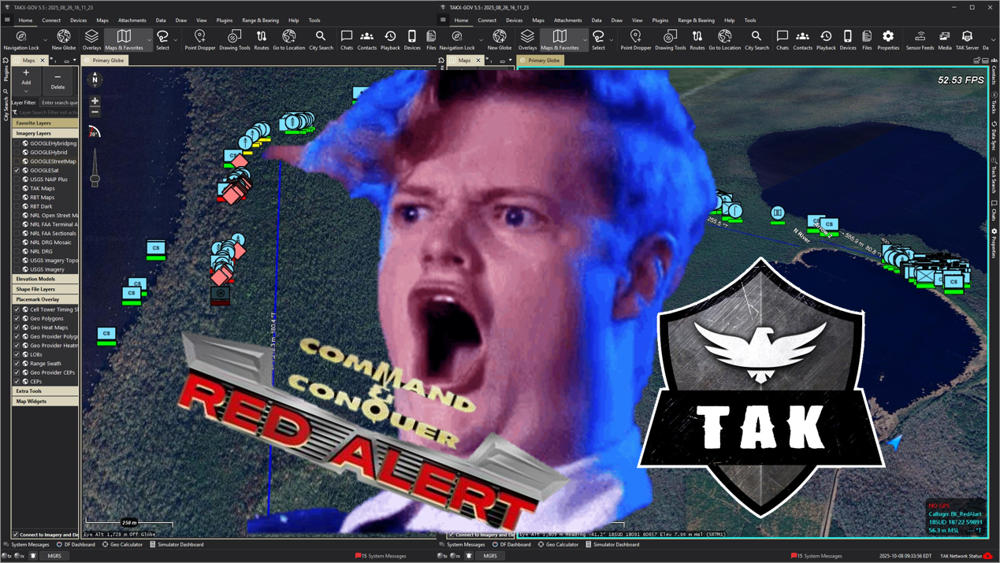

# OpenRA with TAK Support

## Real-Time Strategy Meets Real-World Situational Awareness



OpenRA TAK Support is a fork of [OpenRA](https://github.com/OpenRA/OpenRA) that integrates Cursor-on-Target (CoT) messaging with the TAK ecosystem (TAKX, WinTAK, ATAK). Game units broadcast their positions as MIL-STD CoT XML messages over UDP, appearing as real-time markers on TAK maps. This project also includes a built-in Real-World Map Generator that creates playable maps from actual geographic data using OpenStreetMap.

---

## Quick Start (Build and Play)

<mark>Prerequisite:</mark> [.NET 8.0 SDK](https://dotnet.microsoft.com/en-us/download/dotnet/thank-you/sdk-8.0.414-windows-x64-installer) must be installed.

### For Non-Developers

1. Extract the project folder
2. Double-click **`build-and-play.cmd`** — it builds and launches the game automatically

That's it. One click.

### For Developers

```powershell
# Build
powershell -File make.ps1 all

# Launch
cmd /c launch-game.cmd Game.Mod=ra
```

---

## Features

### Cursor-on-Target (CoT) Integration

All in-game units automatically broadcast CoT messages to TAK applications over UDP:

- **Vehicles, Infantry, Aircraft, Ships, Buildings** — each unit type has a dedicated emitter with MIL-STD-2525C symbology
- **Fog-of-War Aware** — friendly units always emit; hostile units only appear on TAK when detected by allied vision
- **Stealth Gate** — cloaked units are suppressed unless actively engaging
- **Configurable** — UDP host/port, callsigns, update intervals, and symbology are all YAML-configurable per actor type
- **Default Config** — localhost `127.0.0.1:4242`, ready to use with TAKX on the same machine

Open TAKX or WinTAK on the same computer as OpenRA and CoT data populates automatically.

### Real-World Map Generator

Generate playable OpenRA maps from real geographic data without leaving the game:

1. **Extras** -> **Map Editor** -> **Real-World Map**
2. Enter an MGRS coordinate (e.g., `18STJ8690017000` for the Washington DC area)
3. Toggle features: Roads, Water, Vegetation, Buildings, Coastlines
4. Click **Generate** — progress bar shows live status as the pipeline runs
5. Click **Open Map Editor** — place spawn points, resources, and save

The generator produces a 512x512 map at 8 meters per cell (~4km x 4km of real terrain). It fetches OpenStreetMap data via the Overpass API and rasterizes roads, waterways, coastlines, forests, and buildings into OpenRA terrain tiles and actors. All coordinate math (MGRS, UTM, WGS84) is implemented in pure C# with no external dependencies. Results are cached locally to avoid redundant network requests.

Generated maps include geo-referencing metadata for downstream CoT lat/lon coordinate conversion.

### Hostile Markers vs Friendly Markers

Hostile markers are only visible to the player when they are detected by a friendly actor. Friendly markers are always visible to the player.

---

## Setup for TAK Integration

1. Launch the game using `build-and-play.cmd` or the developer commands above
2. Click **Quick Install** and follow the prompts (everything is set up for defaults). Close OpenRA after install completes.
3. Relaunch the game
4. **Singleplayer** -> **Skirmish** -> **Change Map** -> select a geo-referenced map or generate one with the Real-World Map Generator
5. Open TAKX or WinTAK on the same computer — CoT markers appear automatically

Note: TAKX was the primary test platform for this project. WinTAK and ATAK may show different results.

---

## Distributed Mods

Includes a reimagining of:

* Command & Conquer: Red Alert
* Command & Conquer: Tiberian Dawn
* Dune 2000

EA has not endorsed and does not support this product.

Check the [Playing the Game](https://github.com/OpenRA/OpenRA/wiki/Playing-the-game) guide to win multiplayer matches.

## Contribute

* Please read [INSTALL.md](https://github.com/OpenRA/OpenRA/blob/bleed/INSTALL.md) and [Compiling](https://github.com/OpenRA/OpenRA/wiki/Compiling) on how to set up an OpenRA development environment.
* See [Hacking](https://github.com/OpenRA/OpenRA/wiki/Hacking) for a (now very outdated) overview of the engine.
* Read and follow our [Code of Conduct](https://github.com/OpenRA/OpenRA/blob/bleed/CODE_OF_CONDUCT.md).
* To get your patches merged, please adhere to the [Contributing](https://github.com/OpenRA/OpenRA/blob/bleed/CONTRIBUTING.md) guidelines.

## Mapping

* We offer a [Mapping](https://github.com/OpenRA/OpenRA/wiki/Mapping) Tutorial as you can change gameplay drastically with custom rules.
* For scripted missions have a look at the [Lua API](https://docs.openra.net/en/release/lua/).
* If you want to share your maps with the community, upload them at the [OpenRA Resource Center](https://resource.openra.net).

## Modding

* Download a copy of the [OpenRA Mod SDK](https://github.com/OpenRA/OpenRAModSDK) to start your own mod.
* Check the [Modding Guide](https://github.com/OpenRA/OpenRA/wiki/Modding-Guide) to create your own classic RTS.
* There exists an auto-generated [Trait documentation](https://docs.openra.net/en/latest/release/traits/) to get started with yaml files.
* Some hints on how to create new OpenRA compatible [Pixelart](https://github.com/OpenRA/OpenRA/wiki/Pixelart).
* Upload total conversions at [our Mod DB profile](https://www.moddb.com/games/openra/mods).

## Support

* Sponsor a [mirror server](https://github.com/OpenRA/OpenRAWebsiteV3/tree/master/packages) if you have some bandwidth to spare.
* You can immediately set up a [Dedicated](https://github.com/OpenRA/OpenRA/wiki/Dedicated-Server) Game Server.

## License
Copyright (c) OpenRA Developers and Contributors
This file is part of OpenRA, which is free software. It is made
available to you under the terms of the GNU General Public License
as published by the Free Software Foundation, either version 3 of
the License, or (at your option) any later version. For more
information, see [COPYING](https://github.com/OpenRA/OpenRA/blob/bleed/COPYING).
